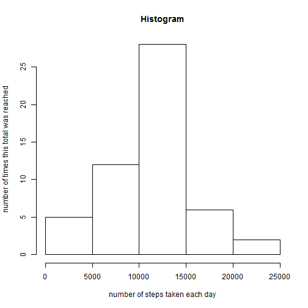

# Reproducible Research: Peer Assessment 1


## Loading and preprocessing the data
1. Load the data.
2. Process/transform the data into a format suitable for your analysis.


```r
#Loading data
activity <- read.csv("activity.csv")
#Convert variable to date/time
activity$date1 <- as.Date(activity$date, format = "%Y-%m-%d")
summary(activity)
```

```
##      steps               date          interval        date1           
##  Min.   :  0.0   2012-10-01:  288   Min.   :   0   Min.   :2012-10-01  
##  1st Qu.:  0.0   2012-10-02:  288   1st Qu.: 589   1st Qu.:2012-10-16  
##  Median :  0.0   2012-10-03:  288   Median :1178   Median :2012-10-31  
##  Mean   : 37.4   2012-10-04:  288   Mean   :1178   Mean   :2012-10-31  
##  3rd Qu.: 12.0   2012-10-05:  288   3rd Qu.:1766   3rd Qu.:2012-11-15  
##  Max.   :806.0   2012-10-06:  288   Max.   :2355   Max.   :2012-11-30  
##  NA's   :2304    (Other)   :15840
```

## What is mean total number of steps taken per day?
1. Make a histogram of the total number of steps taken each day.


```r
#Create plot data
plotdata <- tapply(activity$steps, activity$date, FUN = sum)
#Create plot
hist(plotdata)
```

 

2. Calculate and report the mean and median total number of steps taken per day.


```r
#Aggregrating data before calculating the mean
Aggregrate <- aggregate(steps ~ date, data = activity, FUN= sum, na.action = na.omit )
```

*mean and median*


```r
#Calculate mean and median
mean(Aggregrate$steps)
```

```
## [1] 10766
```


```r
median(Aggregrate$steps)
```

```
## [1] 10765
```


## What is the average daily activity pattern?
1. Make a time series plot of the 5-minute interval and the average number of steps taken, averaged across all days.


```r
#Creating data for plot
AggDailyPattern <- aggregate(steps ~ interval, data = activity, FUN= mean, na.action = na.omit )
#Plotting the data
plot(AggDailyPattern$interval, AggDailyPattern$steps, type = "l")
```

 
2. Which 5-minute interval, on average across all the days in the dataset, contains the maximum number of steps?
*See answer below*


```r
#Sort data descending and take first
Sort <- AggDailyPattern[order(-AggDailyPattern$steps),]
Sort[1,]
```

```
##     interval steps
## 104      835 206.2
```

## Imputing missing values

1. Calculate and report the total number of missing values in the dataset


```r
#SUmmarizing missings
sum(is.na(activity))
```

```
## [1] 2304
```

2. Devise a strategy for filling in all of the missing values in the dataset. The strategy does not need to be sophisticated. For example, you could use the mean median for that day, or the mean for that 5-minute interval, etc.
*I used the inverval avarage for imputing the variabels and have less unknowns and a better spread*

3. Create a new dataset that is equal to the original dataset but with the missing data filled in.


```r
#Create new dataset
activitynomissing <- activity
#Imputing missings
activitynomissing$steps[is.na(activitynomissing$steps)] <- AggDailyPattern$steps
```

4. Make a histogram of the total number of steps taken each day and Calculate and report the mean and median total number of steps taken per day. Do these values differ from the estimates from the first part of the assignment What is the impact of imputing missing data on the estimates of the total daily number of steps?
*I used the inverval avarage for imputing the variabels and have less unknowns and a better spread*


```r
#Create the data
plotdata <- tapply(activitynomissing$steps, activitynomissing$date, FUN = sum)
#Plot the data
hist(plotdata)
```

 

## Are there differences in activity patterns between weekdays and weekends?

1. Create a new factor variable in the dataset with two levelsweekday and weekend indicating whether a given date is a weekday or weekend day.


```r
#Creating weekdays
activitynomissing$days <- weekdays(activitynomissing$date1)


#Create difference between weekday and weekend and make aggregrate
activitynomissing$weekend <- 
  ifelse(activitynomissing$days=='Sunday',"weekend",
         ifelse(activitynomissing$days=='Saturday',"weekend","weekday"))

weekend <- activitynomissing[activitynomissing$weekend=='weekend',]
weekendagg <- aggregate(steps ~ interval, data = weekend, FUN= mean)
weekendagg$label <- "weekend"
weekday <- activitynomissing[activitynomissing$weekend=='weekday',]
weekdayagg <- aggregate(steps ~ interval, data = weekday, FUN= mean)
weekdayagg$label <- "weekday"
```

2. Make a panel plot containing a time series plot of the 5-minute interval and the average number of steps taken, averaged across all weekday days or weekend days. The plot should look something like the following, which was creating using simulated data:


```r
#Creating plotdata
plotdata <- rbind(weekendagg, weekdayagg)

#Loading lattice and creating plot
library(lattice)
xyplot(steps ~ interval | label, data=plotdata, type="l", layout=c(1,2))
```

 
